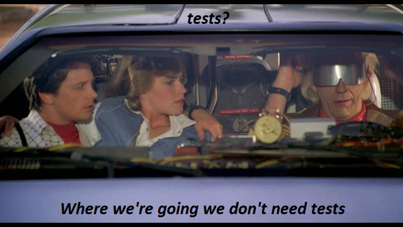

# Partial XSD validator
Yet another _quick_ and dirty python script. A simple python script to validate a fragment of an xml to a schema.



## Instalation
`pip install -r requirements.txt`

## Usage
### Preparing the XSD
By default, the script looks for the first comment in the XSD for the element that will be the root for the partial XML, meaning that if you want to validate something like
```xml
<another-tag>
    <document>
        <some-tag/>
    </document>
</another-tag>
```

You'll need to add a comment to the XSD containing the name of the new root, in this case `document` will be our new root, so we'll add a comment Like this `<!-- document -->`.

### Running the script
Help page:
```
positional arguments:
  target                File or dir to validate
  schema                XSD or directory containing XSD files to apply

optional arguments:
  -h, --help            show this help message and exit
  -o OUTPUT, --output OUTPUT
                        Log output
  -r, --recursive       Search recursively
```

Example:
```sh
# This will compare every xml in docs against every schema in docs/schemas including subdirectories and save the output to log.txt
python validator.py docs docs/schemas -r -o log.txt
```
